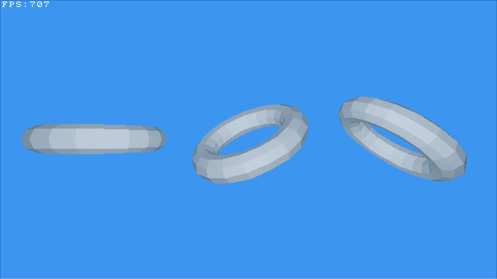

# Repository Moved

**This repository has been archived and is no longer maintained here.**

The project has moved to Codeberg. Please check there for the latest updates, issues, and releases:

**[https://codeberg.org/onatbulut/software-renderer](https://codeberg.org/onatbulut/software-renderer)**

---

<p align="center">
   
</p>

# To Do

- [X] Creating primitive drawing functions
- [X] Rendering a cube
- [X] Backface culling
- [X] Camera movement
- [X] Triangle rasterizer
- [X] Basic lighting
- [X] Wavefront obj import
- [X] *Very basic* triangle clipping on Z axis
- [X] Depth buffer
- [X] Better wavefront obj handling
- [X] Object positioning and transformation
- [ ] Material properties for objects
- [ ] Material template library (.mtl) support
- [ ] Flat shading rasterizer (for better performance on objects that don't need smooth shading)
- [ ] Phong shading rasterizer (to test how it looks and performs in comparison to current Gouraud implementation)
- [ ] Image import for textures
- [ ] Rasterizer for textured triangles
- [ ] Proper clipping implementation
- [ ] Multithreading / Use of SIMD for faster rendering (maybe)
- [ ] ...

# Building and running the application on Linux
```bash
$ git clone https://github.com/OnatBulut/software-renderer.git
$ cd software-renderer
$ make
$ build/software-renderer resources/test.obj
```
\
Note: May compile on Windows but untested. Needs to be done manually. May test it some day.

## Dependencies
[SDL3](https://github.com/libsdl-org/SDL) - needs to be manually installed on your system\
[cglm](https://github.com/recp/cglm) - cloned from source automatically upon build

## Build dependencies:
```
make
cmake
ninja
```
\
\
Special thanks to my friend [ddenizozgur](https://github.com/ddenizozgur) for his guidance on rendering topics.
